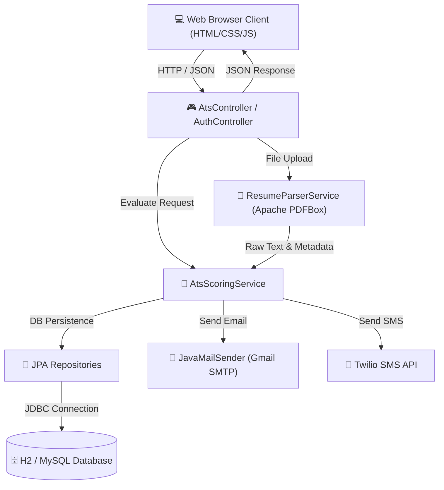
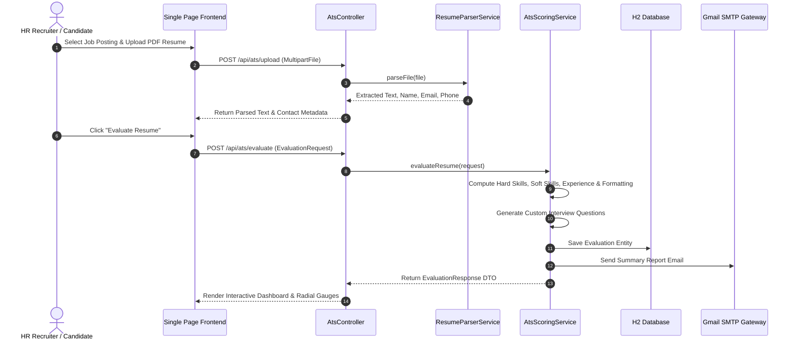

# 📐 ATS Resume Scorer - Complete Master Flow Diagrams & Architecture Document

This document consolidates all **end-to-end flow diagrams, visual system architecture, database ERDs, data processing pipelines, and sequence charts** for the **ATS Resume Scorer & Interactive Viewer** project into a single master document.

---

## 🎨 Table of Contents
1. [End-to-End System Architecture Diagram](#1-end-to-end-system-architecture-diagram)
2. [End-to-End Evaluation Workflow Process](#2-end-to-end-evaluation-workflow-process)
3. [Database Schema & Entity Relationship Diagram (ERD)](#3-database-schema--entity-relationship-diagram-erd)
4. [Component Interaction Flow Chart](#4-component-interaction-flow-chart)
5. [End-to-End Sequence Diagram](#5-end-to-end-sequence-diagram)
6. [Multi-Factor Scoring Engine Mathematical Model](#6-multi-factor-scoring-engine-mathematical-model)

---

## 1. End-to-End System Architecture Diagram

This high-level architecture diagram displays the complete tech stack integration:
- **Frontend Layer**: Single Page Application (HTML5, CSS3, JavaScript ES6+)
- **REST API & Backend Services**: Spring Boot 3 Controller layer (`AtsController`, `AuthController`, `InterviewController`)
- **Document Parsing Engine**: Apache PDFBox library for binary PDF text extraction
- **Scoring Logic**: `AtsScoringService` multi-factor analysis engine
- **Persistence Layer**: Spring Data JPA with embedded H2 / MySQL database
- **External Gateways**: Gmail SMTP email service and Twilio SMS notification API

---

## 2. End-to-End Evaluation Workflow Process

This step-by-step workflow diagram details the 5 sequential phases of candidate resume scoring:
1. **Resume Upload**: Candidate or HR recruiter uploads PDF resume file via web interface.
2. **Text Extraction & Parsing**: Apache PDFBox extracts raw text, candidate name, email, and phone number.
3. **Multi-Factor Analysis**: Compares extracted resume data against selected job requirements (Hard Skills, Soft Skills, Experience, Formatting).
4. **Score Calculation & Match Percentage**: Assigns weighted scores and generates missing keyword gap lists.
5. **Report & Notifications**: Saves evaluation record, renders visual dashboard, and sends email/SMS alerts.

---

## 3. Database Schema & Entity Relationship Diagram (ERD)

This entity-relationship diagram shows the relational schema across all core database tables:
- `USERS`: Stores account credentials and roles.
- `JOB_DESCRIPTIONS`: Holds target job postings and requirements.
- `RESUMES`: Stores candidate resume file information and extracted text.
- `ATS_EVALUATIONS`: Contains overall score metrics, section sub-scores, and keyword gap analysis.
- `INTERVIEW_QUESTIONS`: Stores AI-generated custom interview questions linked to evaluations.

---

## 4. Component Interaction Flow Chart

---

## 5. End-to-End Sequence Diagram

---

## 6. Multi-Factor Scoring Engine Mathematical Model

$$\text{Overall ATS Score} = 0.35 \times S_{\text{hard}} + 0.25 \times S_{\text{exp}} + 0.20 \times S_{\text{soft}} + 0.20 \times S_{\text{format}}$$

Where:
- $S_{\text{hard}}$: **Hard Skills Match** (35% Weight) - Technical stack & domain tool matches.
- $S_{\text{exp}}$: **Experience Match** (25% Weight) - Detected experience years & job title relevance.
- $S_{\text{soft}}$: **Soft Skills Match** (20% Weight) - Communication, leadership, & teamwork indicators.
- $S_{\text{format}}$: **Formatting Score** (20% Weight) - Section structure, contact details, & document readability.
