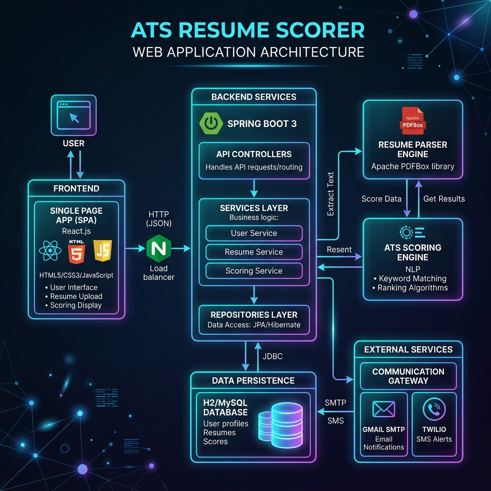
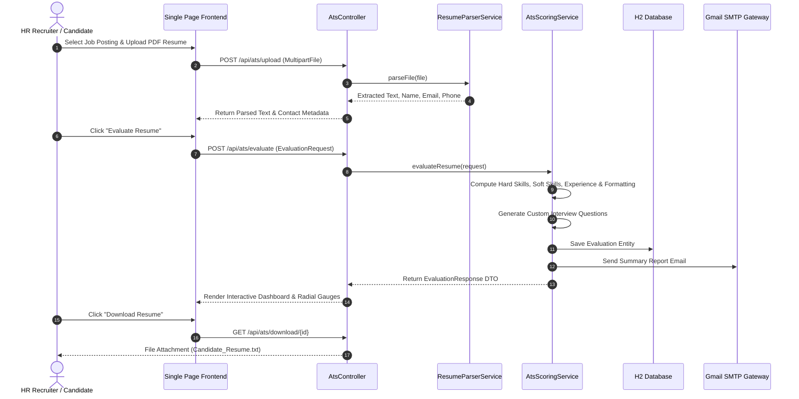

# 📐 ATS Resume Scorer - Master System Architecture, Flow Diagrams & Resume Downloader Document

This document consolidates all **end-to-end flow diagrams, visual system architecture with populated backend/frontend fields, database ERDs, resume generation pipelines, and download option workflows** for the **ATS Resume Scorer & Interactive Viewer** project into a single master document.

---

## 🎨 Master Visual Diagram Directory

| Diagram Title | Description | Image Asset Link |
| :--- | :--- | :--- |
| **Detailed Software System Architecture** | Populated Frontend UI fields, Spring Boot REST controllers, Apache PDFBox, JPA Repositories, Database Schema | [`ats_full_system_detailed.png`](docs/images/ats_full_system_detailed.png) |
| **Resume Generation & Download Options** | Process flow for tailored resume generation, highlighted keywords, score boost, & 1-click Download buttons | [`ats_resume_generator_download.png`](docs/images/ats_resume_generator_download.png) |
| **End-to-End System Architecture** | Web Browser Client, Spring Boot API, ATS Scoring Engine, Database & Email/SMS Gateways | [`ats_system_architecture.png`](docs/images/ats_system_architecture.png) |
| **End-to-End Evaluation Workflow** | 5-Step candidate resume upload, text extraction, multi-factor analysis, scoring & report delivery | [`ats_evaluation_workflow.png`](docs/images/ats_evaluation_workflow.png) |
| **Database ERD Schema** | Relational schema tables (`users`, `job_descriptions`, `resumes`, `ats_evaluations`, `interview_questions`) | [`ats_database_schema.png`](docs/images/ats_database_schema.png) |

---

## 1. Detailed Software System Architecture (Populated Backend & Frontend)

This diagram details all populated parameters, endpoints, and data fields across the application stack:

### Frontend SPA Layer
- **Input Forms**: Resume File Upload (PDF/DOCX), Target Job Title, Requirements Text, Candidate Email/Phone, Shortlist Threshold (%).
- **Interactive Score Gauges**: Overall Match Score (SVG Radial Gauge), Hard Skills (35%), Experience (25%), Soft Skills (20%), Formatting (20%).
- **Resume Viewer & Actions**: Highlighted HTML resume view, Keyword pills (Matched/Missing), **Generate Tailored Resume** & **Download ATS Resume Report** buttons.

### Backend API Controllers (`Spring Boot 3`)
- `POST /api/ats/upload` - Parses PDF files using Apache PDFBox and extracts candidate metadata.
- `POST /api/ats/evaluate` - Runs the 4-factor scoring algorithm and saves evaluation entities.
- `GET /api/ats/download/{id}` - Returns downloadable formatted resume evaluation documents.
- `POST /api/ats/send-notification` - Dispatches live or simulated Gmail SMTP emails & Twilio mobile SMS messages.

---

## 2. Resume Generation & Download Options Process

This infographic shows the 4-step resume optimization, tailored generation, and multi-format download pipeline:

1. **Input Resume & Job Meta**: Upload original resume (PDF/DOCX) and paste target job description.
2. **AI Multi-Factor Analysis**: Extract skills, compute keyword frequency, and match against domain requirements.
3. **Generated Resume Preview**: Render real-time highlighted HTML resume preview with matched technical keywords & ATS score boost.
4. **Resume Options & Actions**:
   - 📥 **Download Resume (TXT/PDF)**: Instantly download formatted resume report (`/api/ats/download/{id}`).
   - 📧 **Email Report**: Dispatch summary report directly to candidate email via Gmail SMTP.
   - 📱 **SMS Alert**: Send mobile SMS status alert via Twilio Gateway.

---

## 3. High-Level End-to-End System Architecture

---

## 4. End-to-End Evaluation Workflow Process

---

## 5. Database Schema & Entity Relationship Diagram (ERD)

---

## 6. End-to-End Sequence Diagram

---

## 7. Multi-Factor Scoring Engine Mathematical Model

$$\text{Overall ATS Score} = 0.35 \times S_{\text{hard}} + 0.25 \times S_{\text{exp}} + 0.20 \times S_{\text{soft}} + 0.20 \times S_{\text{format}}$$

Where:
- $S_{\text{hard}}$: **Hard Skills Match** (35% Weight) - Technical stack & domain tool matches.
- $S_{\text{exp}}$: **Experience Match** (25% Weight) - Detected experience years & job title relevance.
- $S_{\text{soft}}$: **Soft Skills Match** (20% Weight) - Communication, leadership, & teamwork indicators.
- $S_{\text{format}}$: **Formatting Score** (20% Weight) - Section structure, contact details, & document readability.
