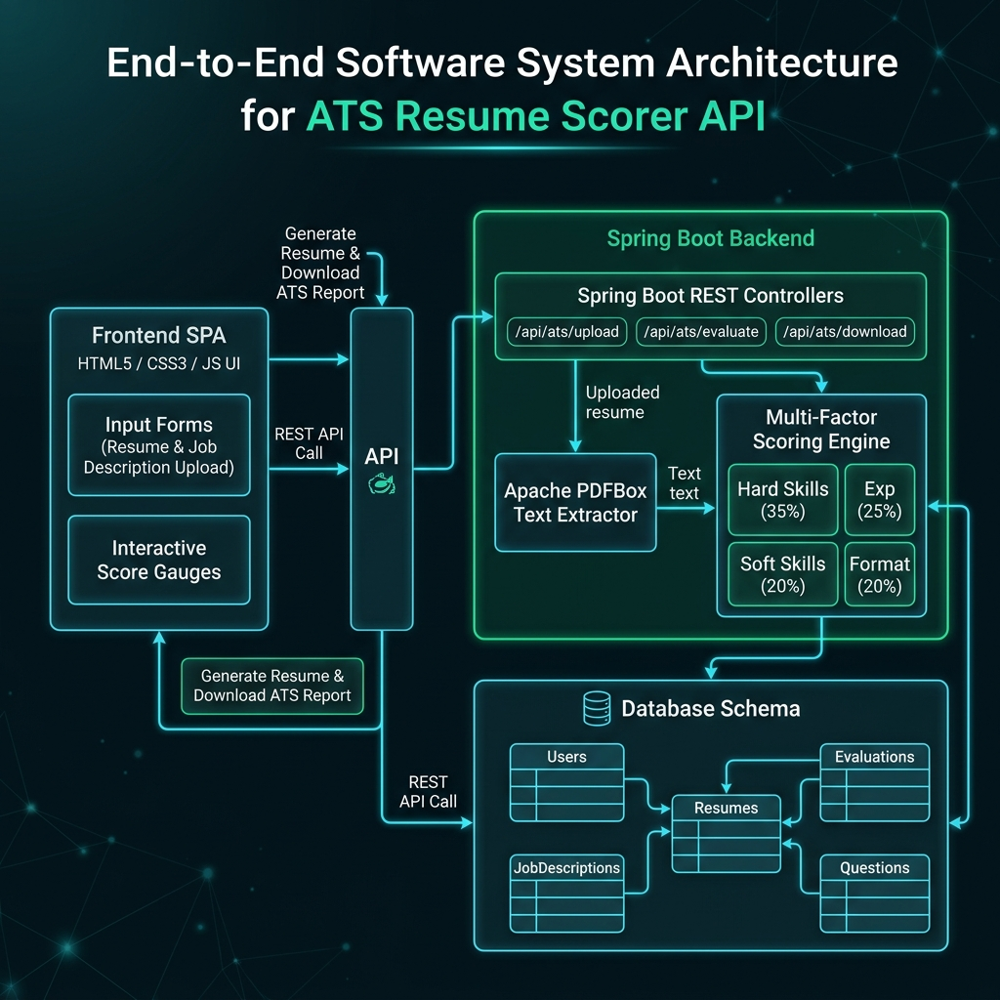
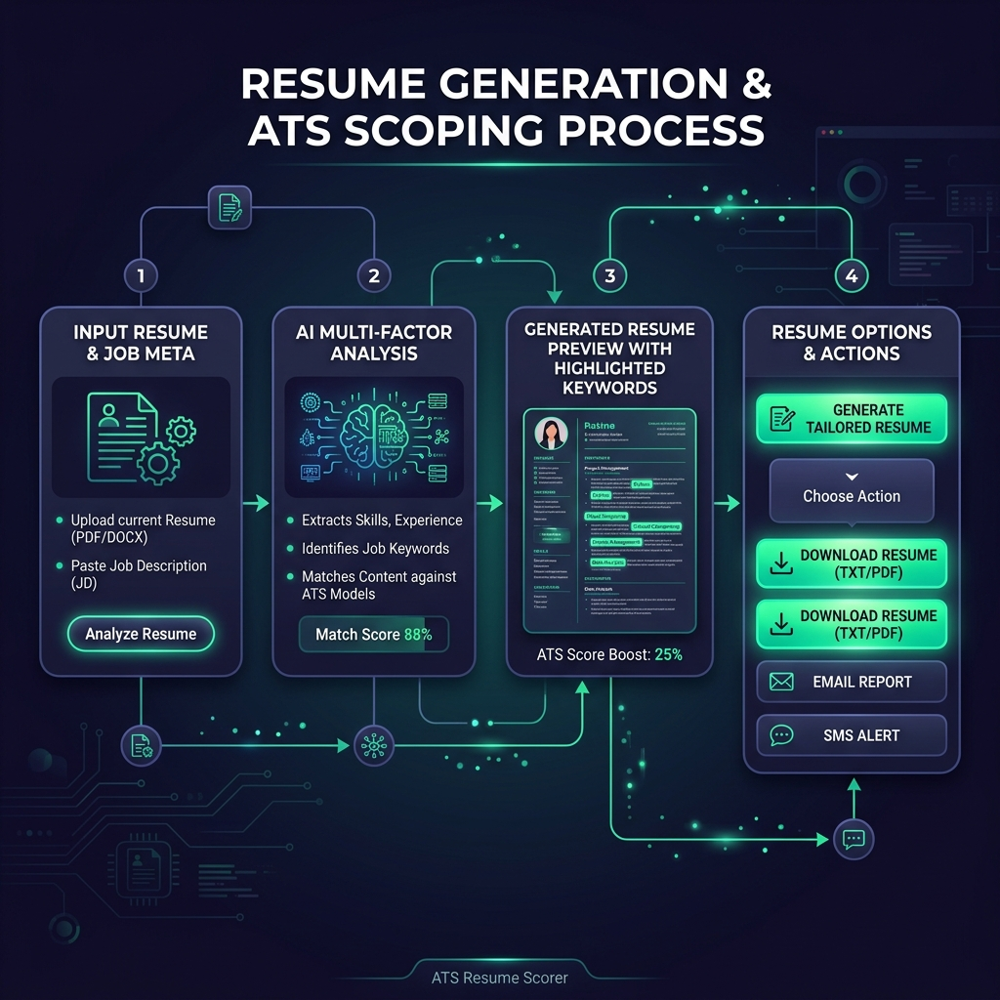
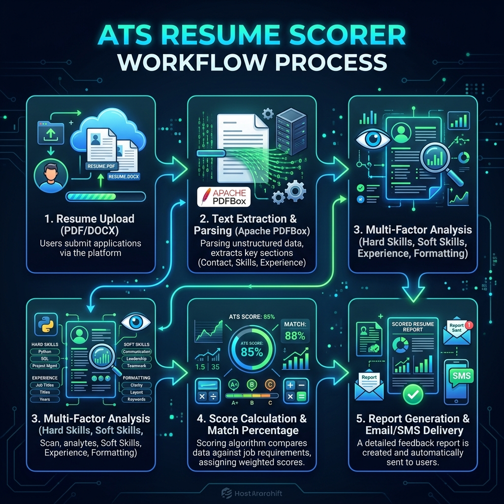
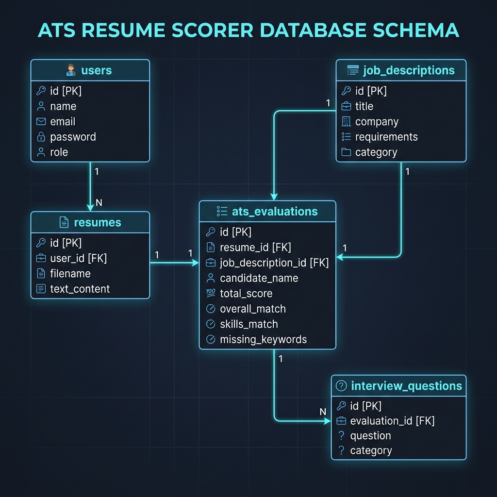

# 🚀 ATS Resume Scorer & Interactive Viewer Application

A modern, full-stack **Applicant Tracking System (ATS) Resume Scorer and Candidate Evaluation Platform** built with **Spring Boot 3**, **Apache PDFBox**, **Spring Data JPA (H2/MySQL)**, and an interactive **Single Page Web Frontend (HTML5/CSS3/JavaScript)**.

> 📘 **Master Diagram Document**: All visual flow diagrams and system architecture charts are stored in a single master document: [`FLOW_DIAGRAMS.md`](file:///Users/chinnesh/Downloads/ats-resume-scorer%202/FLOW_DIAGRAMS.md).

---

## 📌 Executive Summary

The **ATS Resume Scorer** automates resume analysis against job descriptions to provide real-time compatibility scores, keyword gap analyses, missing skill recommendations, and automated AI-driven interview question generation.

### Key Capabilities
- **Multi-Format Resume Parsing**: Parses PDF and text resume uploads with automated candidate metadata extraction (Name, Email, Phone).
- **Multi-Factor Scoring Engine**: Evaluates resume-to-job match using weighted scoring across Hard Skills (35%), Experience & Qualifications (25%), Soft Skills & Cultural Fit (20%), and Formatting/Readability (20%).
- **Keyword & Skill Gap Analysis**: Highlights matched keywords and identifies critical missing hard & soft skills.
- **Automated Interview Question Generator**: Dynamically generates targeted technical and situational interview questions tailored to the candidate's skill gaps.
- **Resume Generation & One-Click Download**: Renders tailored highlighted HTML resumes and allows downloading formatted evaluation reports (`/api/ats/download/{id}`).
- **Email & SMS Notifications**: Integrated with Gmail SMTP and Twilio for sending candidate evaluation reports directly via Email and SMS.

---

## 🛠️ Technology Stack

| Layer | Technology / Library | Description |
| :--- | :--- | :--- |
| **Frontend** | HTML5, Vanilla CSS3, JavaScript (ES6+) | Single-Page Application with responsive dark theme & glassmorphism |
| **Backend Framework** | Spring Boot 3.3.2 | REST API controllers, business logic, dependency injection |
| **Language** | Java 17 / 26 | Modern Java platform |
| **Document Parsing** | Apache PDFBox 3.0.2 | Extracts raw text and candidate metadata from PDF files |
| **Data Access** | Spring Data JPA / Hibernate 6 | ORM persistence layer |
| **Database** | H2 Embedded / MySQL | Embedded H2 database with MySQL compatibility mode |
| **Email Gateway** | Spring JavaMailSender (Gmail SMTP) | Automated email reporting |
| **SMS Gateway** | Twilio REST API | Automated SMS notifications |
| **Build Tool** | Apache Maven 3.x | Dependency management & project build lifecycle |

---

## 📐 Detailed Software System Architecture (Populated Backend & Frontend)



---

## 📥 Resume Generation & Download Options Process



---

## 🔄 End-to-End Evaluation Workflow Process



---

## 🗄️ Database Schema (ERD)



---

## ⚡ Quick Start & Running Locally

### Prerequisites
- **Java Development Kit (JDK 17 or higher)**
- **Apache Maven 3.8+**

### Step-by-Step Instructions

1. **Navigate to Project Directory**:
   ```bash
   cd "/Users/chinnesh/Downloads/ats-resume-scorer 2"
   ```

2. **Build the Application**:
   ```bash
   mvn clean package -DskipTests
   ```

3. **Run the Application**:
   ```bash
   mvn spring-boot:run
   ```

4. **Access the Web Dashboard**:
   Open your browser and navigate to:
   ```text
   http://localhost:8085
   ```

---

## 🔌 API Endpoints Summary

| Endpoint | Method | Request Body | Description |
| :--- | :--- | :--- | :--- |
| `/api/ats/upload` | `POST` | `MultipartFile file` | Uploads PDF resume and extracts text & metadata |
| `/api/ats/evaluate` | `POST` | `EvaluationRequest` | Runs full ATS multi-factor scoring algorithm |
| `/api/ats/download/{id}` | `GET` | Path variable `id` | Downloads formatted resume report (`.txt`) |
| `/api/ats/jobs` | `GET` | None | Retrieves all pre-loaded job description presets |
| `/api/ats/jobs` | `POST` | `JobDescription` | Creates a new job posting preset |
| `/api/ats/evaluations` | `GET` | None | Retrieves list of all past evaluations |
| `/api/ats/evaluations/{id}` | `GET` | Path variable `id` | Retrieves single evaluation report details |
| `/api/ats/send-notification` | `POST` | `Map<String, String>` | Sends email & SMS notification to candidate |
| `/api/interview/generate` | `POST` | `Map<String, String>` | Generates targeted interview questions |

---

## 🎯 Scoring Criteria Breakdown

$$\text{Total Score} = 0.35 \times S_{\text{hard}} + 0.25 \times S_{\text{exp}} + 0.20 \times S_{\text{soft}} + 0.20 \times S_{\text{format}}$$

- **Hard Skills Match (35%)**: Technical skill and domain keyword matches.
- **Experience Match (25%)**: Detected years of experience & job title alignment.
- **Soft Skills Match (20%)**: Leadership, teamwork, and communication indicators.
- **Formatting Score (20%)**: Document structure, contact info presence, & readability.

---

## 📄 License & Attribution
Developed for ATS Resume Optimization & Talent Evaluation. All rights reserved.
